#
 

#

<h2>Hey there! I'm Aditya</h2>

<!-- ## 👋 &nbsp;Hey there! I'm Aditya -->

### 👨🏻‍💻 &nbsp;About Me

💡 &nbsp;I like to explore new technologies and develop software solutions and quick hacks.\
🎓 &nbsp;I have completed my Bachelor of Technology in Computer Science and Engineering from United College of Engineering and Reasearch Prayagraj.\
🌱 &nbsp;I'm on track for learning more about web devlopement, machine learning, and Cloud Architecture.\
✍️ &nbsp;In my free time, I love playing chess and watch anime.\
✉️ &nbsp;You can shoot me an email at rpc1752@gmail.com.! I'll try to respond as soon as I can.
 

#
 

#

### 🛠 &nbsp;Tech Stack

&nbsp;
&nbsp;
&nbsp;
&nbsp;
&nbsp;
&nbsp;
\
&nbsp;
&nbsp;
&nbsp;
&nbsp;
\
&nbsp;

#
### ⚙️ &nbsp;GitHub Analytics
 
 

